# LemonCake — Demo GIF Recording Guide

Two deliverables live in this directory:

1. **`demo.svg`** — ship-ready animated SVG. Self-contained, ~7 KB, loops a 12-second 4-step flow. Renders on GitHub, Dify plugin page, and Coze plugin listing with zero binary dependencies.
2. **`demo.gif` (optional)** — real screen recording of Dify Playground. Use the recipe below when you want to show the actual Dify UX.

---

## Recording the real thing (optional)

### Prerequisites

```bash
brew install --cask rectangle          # window snapping (optional)
brew install ffmpeg gifski             # encoding
```

Dify runs locally — clone `langgenius/dify` and `docker compose up` (takes ~5 min to pull images). Import `lemoncake-0.0.4.difypkg` via Plugins → Install local package.

### Storyboard (30 s target, 12 fps, 960×540)

| t (s) | Scene | Action on screen |
|---|---|---|
| 0–4  | **Setup**          | Dify Workflow canvas → drag `LemonCake / issue_pay_token` node |
| 4–10 | **Issue token**    | Fill `serviceId=openai-gpt4o`, `limitUsdc=5.00`, run → JSON panel shows `{tokenId, jwt, expiresAt}` |
| 10–16| **Use token**      | HTTP Request node → paste `Bearer {{tokenId.jwt}}` → run → `200 OK` with `X-Amount-Usdc` |
| 16–22| **Revoke**         | Call `revoke_token` with `{{tokenId}}` → `{revoked:true}` |
| 22–30| **Reconcile**      | Call `list_charges` → table with 3 rows → zoom into "total: 3" |

### Record (macOS, screen-record quality)

```bash
# 1. Start screen record with macOS built-in (⌘⇧5 → options → 1280×720 frame, Record Portion)
#    Save to ~/Movies/lemoncake-demo.mov

# 2. Crop & speed-up to 1.5× (tighter pacing), 12 fps
ffmpeg -i ~/Movies/lemoncake-demo.mov \
  -vf "setpts=PTS/1.5,fps=12,scale=960:-2:flags=lanczos" \
  -an /tmp/lemoncake-demo.mp4

# 3. Encode to small, crisp GIF with gifski (2-pass-equivalent quality)
ffmpeg -i /tmp/lemoncake-demo.mp4 -vf "fps=12,scale=960:-2:flags=lanczos" /tmp/lc-%04d.png
gifski --fps 12 --width 960 --quality 85 -o demo.gif /tmp/lc-*.png
rm /tmp/lc-*.png
```

Target size: **< 4 MB** (GitHub README inline, Dify marketplace friendly).

### Linting the GIF

```bash
ffprobe -v error -show_entries stream=width,height,nb_frames,duration -of default=nw=1 demo.gif
# Expect: width=960, height=540, duration~20 (post-speedup), frames=240
```

---

## Embedding

**Dify README** (`integrations/dify/lemoncake/README.md`):

```markdown

```

**Coze README** (`integrations/coze/lemoncake/README.md`):

```markdown

```

**Top-level GitHub README**: point to `integrations/_shared/demo/demo.svg` (single source of truth).

If/when the real `demo.gif` is recorded, replace `demo.svg` references **or** keep both:

```markdown

<!-- SVG fallback for GitHub mobile -->
<noscript></noscript>
```
